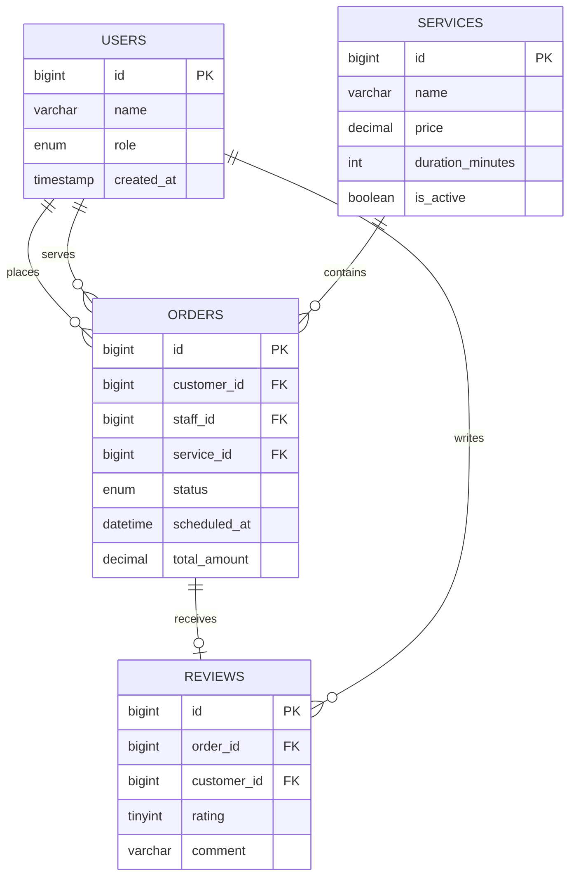

# 核心 ER 图

```mermaid
erDiagram
    USERS ||--o{ ORDERS : places
    USERS ||--o{ ORDERS : serves
    SERVICES ||--o{ ORDERS : contains
    ORDERS ||--o| REVIEWS : receives
    USERS ||--o{ REVIEWS : writes

    USERS {
      bigint id PK
      varchar name
      enum role
      timestamp created_at
    }
    SERVICES {
      bigint id PK
      varchar name
      decimal price
      int duration_minutes
      boolean is_active
    }
    ORDERS {
      bigint id PK
      bigint customer_id FK
      bigint staff_id FK
      bigint service_id FK
      enum status
      datetime scheduled_at
      decimal total_amount
    }
    REVIEWS {
      bigint id PK
      bigint order_id FK
      bigint customer_id FK
      tinyint rating
      varchar comment
    }
```

核心关系：一个客户可以有多笔订单；一个服务人员可以处理多笔订单；一个服务可以对应多笔订单；一笔已完成订单最多对应一条评价。
