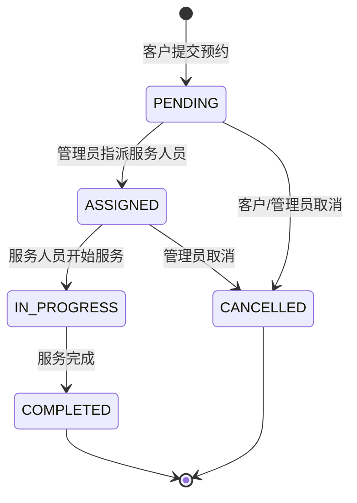

# 订单状态图

```mermaid
stateDiagram-v2
    [*] --> PENDING: 客户提交预约
    PENDING --> ASSIGNED: 管理员指派服务人员
    ASSIGNED --> IN_PROGRESS: 服务人员开始服务
    IN_PROGRESS --> COMPLETED: 服务完成
    COMPLETED --> [*]
    PENDING --> CANCELLED: 客户/管理员取消
    ASSIGNED --> CANCELLED: 管理员取消
    CANCELLED --> [*]
```

状态说明：`PENDING` 待接单，`ASSIGNED` 已指派，`IN_PROGRESS` 服务中，`COMPLETED` 已完成，`CANCELLED` 已取消。
